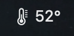
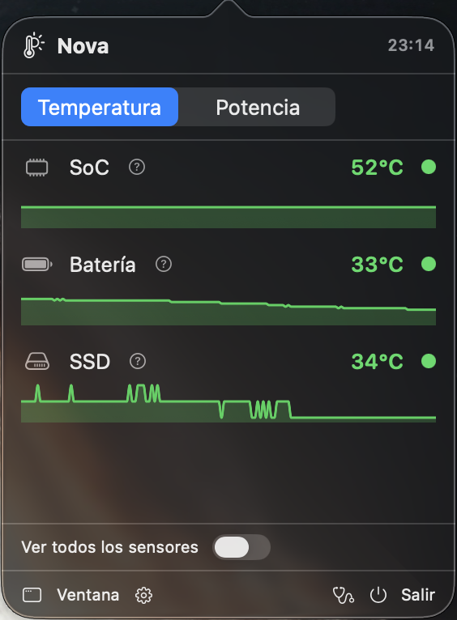
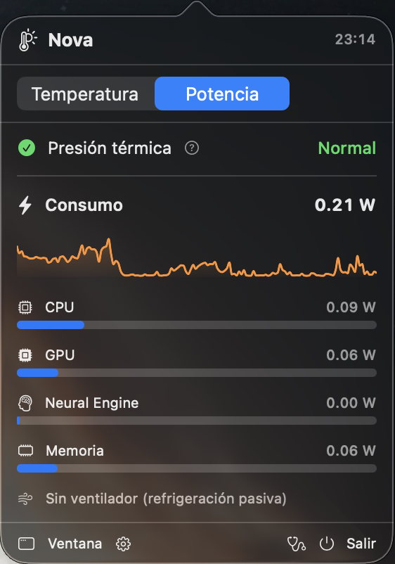

# Nova

App nativa de **macOS (AppKit + SwiftUI)** que muestra en tiempo real las
temperaturas de los sensores internos del Mac (CPU, GPU, SoC, batería, SSD…),
como **app de barra de menú** (junto al icono de batería). Compatible **solo con
Apple Silicon** (M1–M5), macOS **13 Ventura o superior**.

Se compila e instala con un único script (`./install.sh`) **sin Xcode** ni App
Store — solo con las **Command Line Tools**.

Además de temperaturas muestra, en una pestaña aparte, el **consumo eléctrico
por bloque** del SoC (CPU, GPU, Neural Engine, memoria), las **RPM de los
ventiladores** (en los Macs que los tienen) y la **presión térmica** del sistema
(`ProcessInfo.thermalState`: si macOS está aplicando *throttling*).

Incluye **gráficas de historial** (con **Swift Charts**): sparklines compactas en
el desplegable y gráficas grandes en la ventana, con los últimos ~5 min de
temperatura por componente y de consumo (área apilada por bloque).

Tiene una ventana de **Preferencias** para elegir la **unidad de temperatura**
(**°C / °F**), persistida en `UserDefaults` y aplicada al vuelo a toda la UI.

Lee los sensores térmicos a través de la API HID privada de IOKit
(`IOHIDEventSystemClient`), la misma vía que usa
[exelban/stats](https://github.com/exelban/stats); la potencia vía **IOReport**
(grupo `Energy Model`) y los ventiladores vía **AppleSMC**. **No requiere root**
ni entitlements. Al ser un binario suelto (no un `.app` con sandbox), la lectura
funciona directamente.

---

## Capturas

<p align="center">
  <br>
  <sub>En la barra de menú, junto al reloj: la temperatura del SoC.</sub>
</p>

<table>
  <tr>
    <td align="center" width="50%">
      <br>
      <sub><b>Temperatura</b> — máximo por componente, color por severidad y una
      sparkline con su evolución.</sub>
    </td>
    <td align="center" width="50%">
      <br>
      <sub><b>Potencia</b> — presión térmica, consumo total con historial y los
      vatios por bloque.</sub>
    </td>
  </tr>
</table>

---

## Instalar con Homebrew

La forma más rápida, con un solo comando:

```bash
brew install --cask byLuisMoya/nova/nova
```

Instala `Nova.app` en `/Applications`. La app va firmada **ad-hoc** (sin Apple
Developer ID), así que el cask retira el atributo de cuarentena tras instalar
para que Gatekeeper no la bloquee.

> **Autoarranque:** por Homebrew la app **no** arranca sola al inicio de sesión
> por defecto. Puedes activarlo desde la propia app en **Preferencias ▸ "Abrir
> al iniciar sesión"** (instala un LaunchAgent y tiene efecto en el próximo
> login). Mientras tanto, la abres desde Spotlight o con `open -a Nova`.

Desinstalar:

```bash
brew uninstall --cask byLuisMoya/nova/nova   # añade --zap para borrar también preferencias
```

## Instalar y arrancar automáticamente

Para dejarlo instalado como app de barra de menú que **arranca sola en cada
inicio de sesión**, sin `sudo` ni App Store.

**Requisitos:** Mac con **Apple Silicon**, macOS **13+** y las **Command Line
Tools** (`xcode-select --install`). No hace falta Xcode ni root.

```bash
cd nova
./install.sh
```

El instalador:

1. Compila en **release**.
2. Crea un bundle `.app` autónomo en **`~/Applications/Nova.app`** (con su
   `Info.plist`: `LSUIElement`, bundle id `io.github.byluismoya.Nova`, el icono
   `AppIcon.icns`, etc.) y lo firma **ad-hoc** (`codesign -s -`).
3. Instala un **LaunchAgent** en
   **`~/Library/LaunchAgents/io.github.byluismoya.Nova.plist`** con `RunAtLoad` y
   `LimitLoadToSessionType = Aqua`.
4. Lo carga y lo arranca ya (`launchctl bootstrap` + `kickstart`).

Comportamiento:

- **En cada login** se lanza solo y aparece 🌡 en la barra de menú.
- El botón **"Salir"** lo cierra hasta el próximo inicio de sesión (no se usa
  `KeepAlive`, así que "Salir" funciona de verdad y no se relanza al instante).
  Para **reabrirla sin reiniciar sesión**: Spotlight (`⌘ Espacio` → "Nova"),
  doble clic en `~/Applications/Nova.app`, o `open ~/Applications/Nova.app`.
- No aparece en el Dock (`.accessory` / `LSUIElement`).

Actualizar tras cambiar código (recompila, reemplaza el bundle y relanza):

```bash
./install.sh
```

Desinstalar (para el proceso, quita el LaunchAgent y borra el `.app`):

```bash
./uninstall.sh
```

Comprobar que está activo:

```bash
launchctl print "gui/$(id -u)/io.github.byluismoya.Nova" | grep -E 'state|pid'
```

> **Firma ad-hoc:** como el binario se compila en tu propia máquina, no lleva
> atributo de cuarentena y Gatekeeper no lo bloquea. Si copiaras el `.app` a
> **otro** Mac por internet, ahí sí harían falta Developer ID + notarización
> (ver [Distribución](#distribución)).

---

## Uso

- Haz clic en el **termómetro 🌡** de la barra de menú para abrir el desplegable.
- El desplegable tiene dos pestañas, **Temperatura** y **Potencia**. En
  Temperatura ves el máximo por componente con color por severidad y una
  **sparkline** de su evolución bajo cada uno; activa **"Ver todos los
  sensores"** para la lista completa. En Potencia, la presión térmica, el
  consumo total con su sparkline y las barras por bloque.
- **"Ventana"** abre la vista detallada con las mismas dos pestañas y **gráficas
  grandes**: una línea por componente en Temperatura, y **área apilada por
  bloque** (la altura total es el consumo total) en Potencia.
- El botón **⚙️** (junto a "Ventana") abre **Preferencias**, donde eliges la
  unidad de temperatura **°C / °F**. El botón **🩺** (junto a "Salir") guarda el
  diagnóstico. **"Salir"** cierra la app (para reabrirla, ver arriba).

---

## Estructura del proyecto

```
nova/
├── Package.swift                      # 2 targets: CIOKitHID (C) + Nova (exe)
├── Sources/
│   ├── CIOKitHID/                     # símbolos PRIVADOS de IOKit
│   │   ├── include/CIOKitHID.h        #   declaraciones IOHID* (módulo C)
│   │   └── shim.c
│   └── Nova/
│       ├── main.swift                 # NSApplication (.accessory) + AppDelegate
│       ├── AppDelegate.swift          # NSStatusItem + NSPopover + ventana
│       ├── MenuBarPopoverView.swift   # UI del desplegable (SwiftUI)
│       ├── ContentView.swift          # ventana con pestañas Temperatura/Potencia
│       ├── ThermalViewModel.swift     # ObservableObject + Timer (refresco auto)
│       ├── SensorReader.swift         # capa de lectura IOKit/HID (temperatura)
│       ├── SystemStats.swift          # potencia (IOReport), ventiladores, thermalState
│       ├── HistoryCharts.swift        # buffer de historial + gráficas (Swift Charts)
│       ├── AppSettings.swift          # preferencias (unidad °C/°F) + PreferencesView
│       ├── SensorModels.swift         # sensor, categorías, severidad/color
│       └── Diagnostics.swift          # informe de sensores (--dump / botón 🩺)
├── Resources/AppIcon.icns             # icono del bundle (.app)
├── tools/
│   ├── make-icon.swift                # dibuja el icono "Nova" (varios estilos)
│   └── make-icon.sh                   # PNG → iconset → AppIcon.icns
├── install.sh                         # instala .app + LaunchAgent (autoarranque)
├── uninstall.sh                       # desinstala todo
└── README.md
```

### El bridging header, en SwiftPM
SwiftPM no admite Objective-C bridging headers, así que los símbolos privados de
IOKit se declaran en un **target de C** (`CIOKitHID`, en
`Sources/CIOKitHID/include/CIOKitHID.h`) que el ejecutable importa con
`import CIOKitHID`. El framework IOKit se enlaza vía
`.linkedFramework("IOKit")` en `Package.swift`.

### Icono
El icono del `.app` (`Resources/AppIcon.icns`) se genera por código: una
supernova de 4 puntas sobre una rejilla en perspectiva estilo *synthwave/outrun*.
Se dibuja en `tools/make-icon.swift` (que soporta varios estilos: `solar`,
`neon`, `outrun`, `holo`) y se empaqueta en `.icns` con `tools/make-icon.sh`.
Para regenerarlo:

```bash
./tools/make-icon.sh           # usa el estilo "outrun" por defecto
./tools/make-icon.sh neon      # o cualquier otro estilo
```

`install.sh` copia ese `.icns` al bundle y lo declara en `CFBundleIconFile`.

> La **barra de menú** usa un termómetro (SF Symbol), no este icono: comunica de
> un vistazo qué hace la app. El `.icns` es solo la identidad en Finder/Spotlight.

---

## Cómo funciona la lectura de sensores

En Apple Silicon los sensores de temperatura se exponen como **servicios HID**.
El flujo (en `SensorReader.swift`) es:

1. `IOHIDEventSystemClientCreate` → crea el cliente HID.
2. `IOHIDEventSystemClientSetMatching` con
   `{ PrimaryUsagePage: 0xff00, PrimaryUsage: 0x0005 }` → filtra solo sensores de
   temperatura del *vendor* Apple.
3. `IOHIDEventSystemClientCopyServices` → servicios que casan.
   **⚠️ Con App Sandbox activo esta llamada devuelve una lista vacía.**
4. Por cada servicio:
   - Nombre con `IOHIDServiceClientCopyProperty("Product")`, *fallback* a
     `"DeviceName"`.
   - Valor con `IOHIDServiceClientCopyEvent(..., type = 15, ...)` +
     `IOHIDEventGetFloatValue(event, 15 << 16)` (`15` = `kIOHIDEventTypeTemperature`).

Los sensores se **descubren dinámicamente** (los nombres varían entre chips) y se
**clasifican por componente** (`SensorCategory.classify`): `gas gauge/batt`→
Batería, `nand/ssd`→SSD, `gpu`→GPU, `cpu/core/pacc`→CPU, `pmu/soc/die/ane`→SoC,
resto→Otros. Cada grupo muestra su valor **máximo** y **medio**.

> Verificado en este Mac: se leen 44 sensores (`PMU tcal`, `PMU tdie*`,
> `NAND CH0 temp`, `gas gauge battery`, …).

Colores por severidad: **verde < 55 °C · amarillo 55–70 °C · rojo > 70 °C**.
Refresco automático cada **2 s** (`ThermalViewModel.refreshInterval`).

### Potencia, ventiladores y presión térmica

Toda esta fontanería vive en el shim de C (`Sources/CIOKitHID/shim.c`), que
expone funciones limpias a Swift (`SystemStats.swift`):

- **Potencia** — `IOReport`, grupo **`Energy Model`**. Se mantiene una
  suscripción y una muestra previa; en cada refresco se calcula la energía
  consumida (`IOReportCreateSamplesDelta`) desde la muestra anterior y se divide
  por el tiempo transcurrido → **vatios**. Se normaliza por la etiqueta de unidad
  (`nJ`/`µJ`/`mJ`/`J`) y se suman los canales agregados `CPU Energy`,
  `GPU Energy`, `ANE` y `DRAM`. Verificado en un M5: ~1 W en reposo, ~10 W de CPU
  bajo carga. Se enlaza `-lIOReport` en `Package.swift`.
- **Ventiladores** — `AppleSMC` vía `IOConnectCallStructMethod` (selector 2):
  `FNum` da el número de ventiladores y `F<i>Ac` sus RPM (float). En Macs
  **sin ventilador** (p. ej. MacBook Air) `FNum` es 0 y la pestaña lo indica.
- **Presión térmica** — `ProcessInfo.thermalState` (API pública):
  normal / moderado / alto / crítico, indica si macOS está haciendo *throttling*.

### Gráficas de historial

En `HistoryCharts.swift` (UI) y en `ThermalViewModel` (datos):

- El ViewModel guarda un **buffer circular** por serie (temperatura por
  componente, potencia por bloque y total), de **150 muestras** (`historyCapacity`)
  ≈ **5 min** a 2 s. En cada refresco añade un punto y recorta el más antiguo.
- Se dibujan con **Swift Charts** (`import Charts`, nativo en macOS 13+, sin
  dependencias): `Sparkline` compactas (línea + área, recortadas a su celda con
  `.chartPlotStyle { $0.clipped() }`) en el desplegable, y `TempHistoryChart` /
  `PowerHistoryChart` (área apilada) en la ventana. Las series llevan color
  estable por componente, aparte de la codificación por severidad de los textos.

### Preferencias (°C / °F y autoarranque)

En `AppSettings.swift`:

- `AppSettings.shared` es un `ObservableObject` singleton con la unidad elegida,
  **persistida en `UserDefaults`** (clave `temperatureUnit`); se guarda en cuanto
  cambia y se restaura al arrancar.
- Los sensores se leen y almacenan **siempre en °C**; `TemperatureUnit.convert` /
  `.format` hacen la conversión **solo al mostrar**. La **severidad y sus
  colores** se calculan sobre los °C reales, así que los umbrales no cambian.
- Se inyecta con `@EnvironmentObject` en el desplegable y la ventana, de modo que
  al cambiar la unidad se refresca al vuelo todo (incluido el eje de la gráfica
  grande). La barra de menú, que es AppKit, se suscribe a `settings.$unit` para
  repintar su título. Las sparklines no se convierten: al no tener eje, la forma
  es idéntica en °C y °F.
- **Abrir al iniciar sesión** (`LoginItemManager.swift`): un toggle escribe o
  borra un LaunchAgent en `~/Library/LaunchAgents` — el **mismo** (label y ruta)
  que instala `install.sh`, así que ambas vías son intercambiables. No usa
  `SMAppService` (que exige firma; con ad-hoc es dudoso) ni `launchctl`: activar
  solo escribe el `.plist` (launchd lo carga en el próximo login, sin lanzar una
  segunda instancia) y desactivar solo lo borra (sin `bootout`, para no cerrar la
  app en marcha). La fuente de verdad del estado es la existencia del `.plist`,
  no un booleano en `UserDefaults`.

---

## Modo diagnóstico

Vuelca la lista cruda de **todos** los sensores (nombre, valor y categoría en que
los clasifica la app), más el chip y la versión de macOS. Útil para ver qué
expone un chip concreto (p. ej. si un M3/M4 publica sensores de CPU/GPU o solo de
SoC) y ajustar la clasificación.

Dos vías:

- **Desde la app:** botón 🩺 (*stethoscope*) en el desplegable → escribe el
  informe y lo abre en el Finder.
- **Línea de comandos** (usando el binario instalado; sirve incluso por SSH):

  ```bash
  ~/Applications/Nova.app/Contents/MacOS/Nova --dump
  ```

  Imprime el informe por pantalla y lo guarda en `./Nova-sensores.txt`.

Ejemplo (Apple M5): 44 sensores, todos `PMU tdie/tcal/tdev` → `[SoC]`, más
`NAND CH0 temp` → `[SSD]` y `gas gauge battery` → `[Batería]`.

---

## Manejo de errores

Si no se encuentran sensores, la app **no falla en silencio**: el ViewModel
publica un `errorMessage` y el desplegable / la ventana muestran un aviso con la
causa probable y un botón para reintentar.

---

## Distribución

El `.app` va **firmado ad-hoc**, suficiente para usarlo en tu propio Mac. Si
quisieras firmarlo "de verdad" para otros equipos sin retirar cuarentena,
tendrías que usar **Developer ID**, activar **Hardened Runtime** y
**notarizarlo** (`xcrun notarytool` + `stapler`). Como la lectura de sensores
exige el App Sandbox **desactivado**, la app **no es publicable en la Mac App
Store**.

### Publicar una versión en Homebrew

El cask vive en un tap propio: [`byLuisMoya/homebrew-nova`](https://github.com/byLuisMoya/homebrew-nova).
Para sacar una versión nueva:

1. Empaqueta el `.app` en un `.zip` y obtén su `sha256`:

   ```bash
   ./tools/package-release.sh 1.1        # genera Nova-1.1.zip + imprime el sha256
   ```

2. Crea un **GitHub Release** con tag `v1.1` en este repo y sube `Nova-1.1.zip`
   como asset.

3. En el tap, edita `Casks/nova.rb`: actualiza `version` y `sha256` (la `url` ya
   usa `#{version}`, no hace falta tocarla).

El cask retira la cuarentena en un bloque `postflight` (la app es ad-hoc), de
modo que `brew install --cask byLuisMoya/nova/nova` abre sin bloqueo de
Gatekeeper.

---

## Notas

- **Solo Apple Silicon** (M1–M5). No soporta Intel.
- macOS **13+**. No requiere root.
- Ejecuta desde una sesión gráfica local (la barra de menú necesita WindowServer;
  no funciona por SSH sin sesión de ventanas).

---

## Licencia

[MIT](LICENSE) © byLuisMoya. Úsalo, modifícalo y distribúyelo libremente,
manteniendo el aviso de copyright. Se ofrece *tal cual*, sin garantías.
